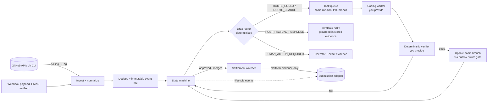

# Drex PR Shepherd

**Autonomous post-PR orchestration for coding agents.**

```
submitted PR → CI/review monitoring → bounded repair routing → deterministic reverification
             → same PR / same mission → merge/close tracking → settlement monitoring
```

Drex PR Shepherd watches submitted pull requests, classifies CI/review events, routes bounded repair work to coding agents, re-verifies changes, keeps the same PR alive through review, and tracks settlement separately from code acceptance.

> **Alpha (v0.1.0).** Not production-hardened. It does not promise passive income, bounty payouts, or that any PR will be accepted or merged.

| Capability | v0.1 status |
|---|---|
| Read-only polling, dry-run outbox, offline demo | **READY** |
| Webhook event ingestion + HMAC verification | READY (library/CLI; **no bundled HTTP server**) |
| Real GitHub writes (push, reply, comment) | **EXPERIMENTAL / NOT ENABLED IN v0.1** (disabled by default; no CLI or env switch) |

## Key ideas

* **Comments are untrusted data.** Reviews, comments, CI logs and filenames are redacted, bounded and quoted as evidence. They are never executed or treated as instructions.
* **Drex routes; it does not decide correctness.** It observes, classifies, dedupes, prioritizes and picks a specialist. It never declares code correct, never overrides the verifier, and cannot merge.
* **Verification is deterministic and external.** You plug in the `Verifier`; its verdict is final.
* **Merged ≠ paid.** `APPROVED`, `MERGED`, `ACCEPTED_PAYOUT` and `REALIZED_REVENUE` are separate states. Only platform-probe evidence advances settlement.
* **Same PR, same mission.** Feedback creates revision rounds on the original task and branch, never a new mission or PR.
* **Live writes are disabled by default.**

## Quick start

Python 3.10+, no runtime dependencies.

```bash
git clone https://github.com/colt2822/drex-pr-shepherd.git
cd drex-pr-shepherd
pip install -e .
drex-shepherd demo            # primary demo: fake GitHub, fake worker, fake verifier
python -m unittest     # or: pip install -e '.[dev]' && pytest
```

## Demo

`drex-shepherd demo` (add `--json` for a machine-readable summary) plays, deterministically and offline:

```
submitted → CI failed → repair routed → verifier passed → same PR updated
          → changes requested → second bounded revision → approved → merged → settlement pending
```

Nothing leaves the process.

## CLI

```
drex-shepherd watch <pr-url> --mission-id M --task-id T [--fetch | --head-sha S --head-branch B [--head-repository owner/fork]]
drex-shepherd status [--json]
drex-shepherd tick                     # poll due PRs once (GitHub reads only)
drex-shepherd events <pr-url | owner/repo#N>
drex-shepherd tasks                    # queued repair/revision contracts for an external worker
drex-shepherd release <pr> --reason "..." [--reset-budgets]   # operator: resume a HUMAN_ACTION_REQUIRED hold (no GitHub write)
drex-shepherd ingest --event E --file payload.json --signature sha256=...   # HMAC-verified webhook payload
drex-shepherd doctor
drex-shepherd demo [--json]
```

Configuration is environment-based; see [.example.env](.example.env).

## Architecture



Details: [ARCHITECTURE.md](ARCHITECTURE.md).

## Security model

GitHub content is hostile by assumption: prompt injection, embedded commands, malicious filenames, fork/branch confusion and actor spoofing are handled by typed routing, quoting, path/ref validation, trust from API `author_association` only, HMAC-verified webhooks, and dry-run-by-default writes. Do not put secrets in payloads. Sandbox your worker and verifier. Full model and reporting guidance: [SECURITY.md](SECURITY.md).

## State machine

```
WATCHING ─ CI fail ─▶ CI_FAILED ─▶ REPAIR_QUEUED ─▶ REPAIRING ─▶ REVERIFYING ─▶ READY_TO_UPDATE ─▶ WATCHING / AWAITING_REVIEW
   │  └ review feedback ─▶ REVIEW_CHANGES_REQUESTED ─▶ (same repair path)
   │  └ maintainer question ─▶ MAINTAINER_RESPONSE_REQUIRED
   ├─▶ APPROVED ─▶ MERGED ─▶ SETTLEMENT_PENDING ─▶ ACCEPTED_PAYOUT ─▶ REALIZED_REVENUE
   ├─▶ CLOSED (terminal: coding loop stops)
   └─▶ HUMAN_ACTION_REQUIRED (budget exhausted / instruction-like text / ungrounded question) ─ release ─▶ WATCHING
```

Limits `MAX_REVISION_ROUNDS`, `MAX_CI_REPAIR_ROUNDS`, `MAX_CONSECUTIVE_UNKNOWN_FAILURES` (default 3 each) are set via `PR_SHEPHERD_*` variables.

## GitHub adapter

`GitHubReader` (PR state, reviews, review/issue comments, check runs, commits, merge status, changed files) and `GitHubWriter` (push update, reply, PR comment) are separate interfaces. `ApiClientAdapter` runs on any transport: REST via `urllib` or the `gh` CLI. The CLI builds a read-only adapter.

## Integration API

```python
from pr_shepherd.core.engine import Shepherd
from pr_shepherd.storage.sqlite import Store
from pr_shepherd.adapters.github import ApiClientAdapter, UrllibTransport
from pr_shepherd.adapters.submission import Submission, SubmissionAdapter

sh = Shepherd(Store("shepherd.db"), reader=ApiClientAdapter(UrllibTransport()),
              submissions=MySubmissionAdapter(),      # your system; receives lifecycle events
              worker=my_worker, verifier=my_verifier) # both optional: without them tasks queue
sh.watch(Submission(mission_id=..., task_id=..., submission_receipt_id=..., artifact_digest=..., pr_url=...),
         head_sha=..., head_branch=..., base_branch="main")
sh.tick()
```

Seams: `Worker.run(contract) -> WorkerResult`, `Verifier.verify(contract, result) -> VerificationResult`, `SubmissionAdapter.emit(event)` / `fetch_settlement_evidence(...)`. To integrate a specific pipeline, implement `SubmissionAdapter` in your own package.

## Current limitations

* No real GitHub writes: CLI is read-only; the write path is experimental and only tested against fakes (a `push_runner` is not provided).
* No HTTP webhook listener; only signature verification and ingestion.
* No bundled coding worker or verifier.
* One worker attempt per poll; retries wait for the next poll.
* Dry-run replies are not auto-sent if writes are enabled later.
* The classifier accepts a "base branch also failing" hint, but the poller does not yet fetch it.
* Alpha: schema may change between releases.

## Roadmap

* Vetted, opt-in GitHub write support (push runner, reply, comment) with an integration test suite.
* Reference HTTP webhook receiver.
* Base-branch CI comparison; richer flake detection.
* Reference worker/verifier adapters.

## License

Apache-2.0. See [LICENSE](LICENSE) and [CHANGELOG.md](CHANGELOG.md).
